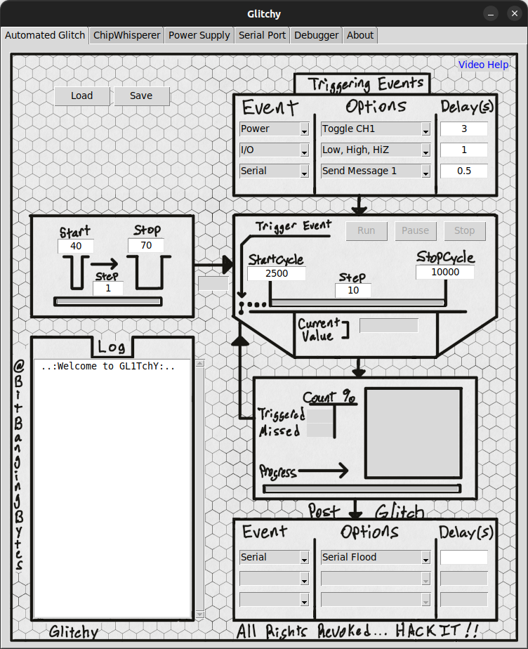
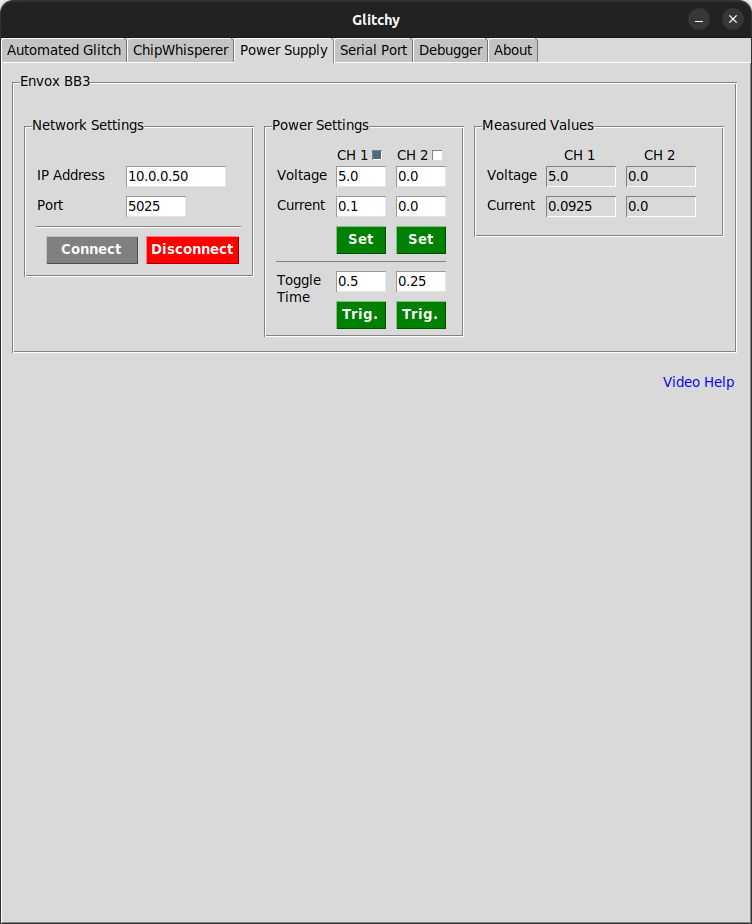
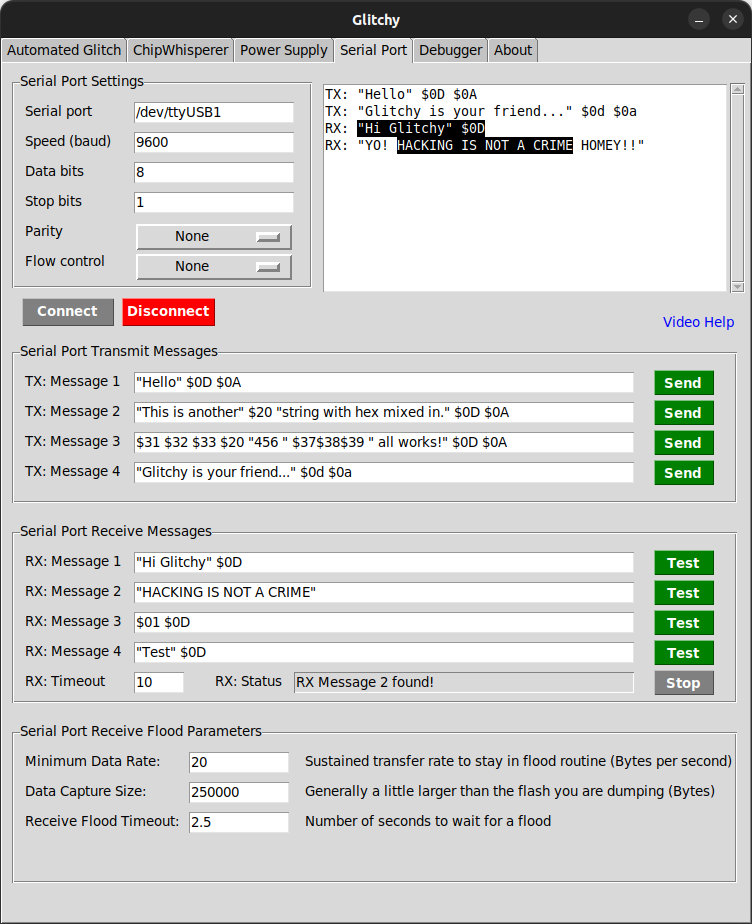
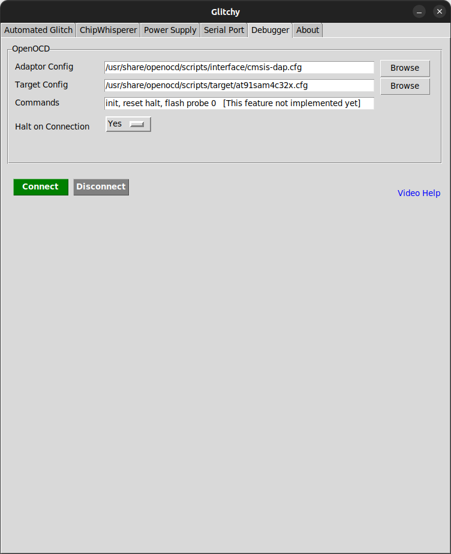

# Glitchy
<p align="center">  </p>

---

Glitching microcontrollers to reveal hidden secrets can seem like a dark art performed by 
hardware magicians. Staring at code and counting clock cycles doesn't make it any more 
approachable to new users.

Glitchy is a visual interface to the world of glitching. It ties together other hardware
such as power supplies, serial interfaces and debugging tools which are often used as part
of a successful glitch attack.

Check out the [YouTube](https://youtu.be/TrEsTD9i0LU) video introduction

---

# Installation

Ensure you have privileges to use USB serial devices (dialout in Ubuntu), Debug adaptors via 
OpenOCD and permissions to access the Chipwhisperer. Those devices should be configured properly 
prior to using Glitchy.

requirements.txt contains the necessary Python packages. Install with the following commands:

```
git clone https://github.com/BitBangingBytes/Glitchy.git
cd Glitchy
pip3 install -r requirements.txt
```

To Run:
```
cd src
python3 Main.py
```

---

# Disclaimer

This is a tool I am using to teach myself Python, GUI programming and push into an uncomfortable 
space, software development! I have always been comfortable with hardware, but not so much with
large software projects. With that said, any contributions that improve the code style or
structure with explanations would be greatly appreciated!

---

# License

Feel free to use this however you wish, by reading this sentence you have voided your warranty!

Happy Hacking

---

# Screen Shots






